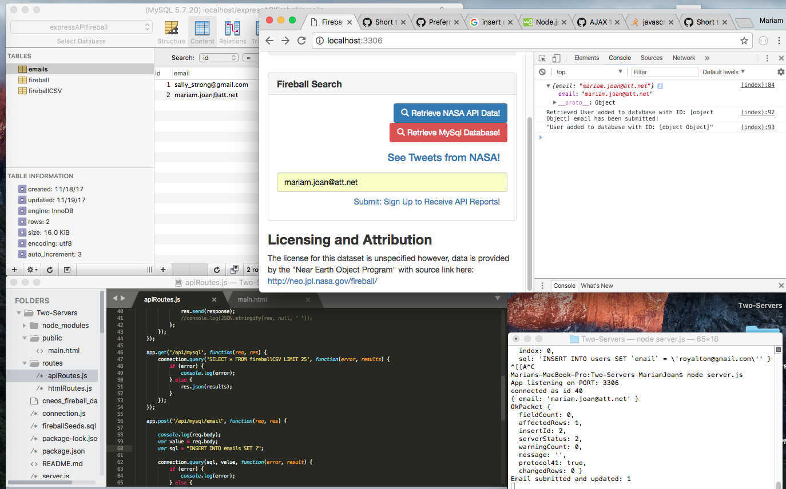

# Two-Servers

# **Instructions to Build an Express Application:**

- Create an API that will return 3 different pieces of data based on 3 different routes. All data should be in JSON format
- Connect the Express application to a local MySQL database. Make sure that the API request is getting the information from the MySQL database
- Be sure to have structure and information in sql files

# **Table Column Descriptions For NASA Fireball API Fireball***

# **Peak Brightness Date/Time (UT)**
The date and time in UT (Universal Time) of this event's peak brightness.

# **Latitude (deg.)**
Geodetic latitude in degrees north (N) or south (S) of the equator for this event.

# **Longitude (deg.)**
Geodetic longitude in degrees east (E) or west (W) of the prime meridian for this event.

# **Altitude (km)**
Altitude in kilometers (km) above the reference geoid for this event.

# **Velocity (km/s)**
The magnitude of the meteor's pre-impact velocity in kilometers per second (km/s).

# **Velocity Components (km/s)**
The magnitude of the meteor's pre-impact velocity in a geocentric Earth-fixed reference frame defined as follows: the z-axis is directed along the Earth's rotation axis towards the celestial north pole, the x-axis lies in the Earth's equatorial plane, directed towards the prime meridian, and the y-axis completes the right-handed coordinate system.

# **Total Radiated Energy (J)**
The approximate total radiated energy in the atmosphere in Joules [a unit of energy given in kilograms times velocity squared, or kg × (m/s)2]

# **Calculated Total Impact Energy (kt)**
The impact energy of the event in kilotons of TNT (kt) computed from an empirical expression relating radiated and impact energy (see the Introduction for more details).