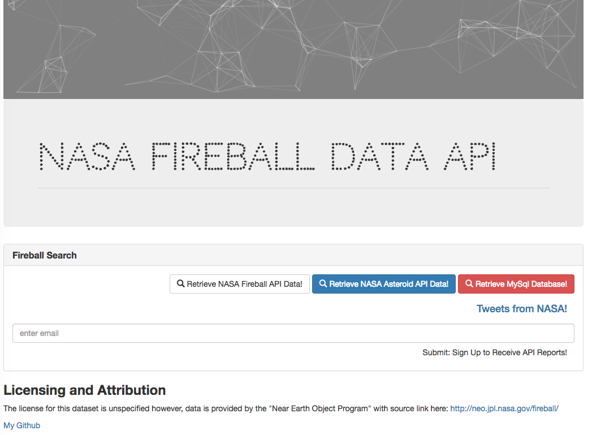

# NASA-Fireball-API

Check out [my demo](http://nasa-fireball-api.herokuapp.com/) to study my app's basic functionality. This demo is deployed on Heroku! This app was my example of creating an API that will return 3 different data points based on 3 different routes. All data returned is in JSON format. I connect this Express application to a local MySQL database while I also connect to NASA's Twitter feed using my Twitter developer account and API keys.

## Table Column Descriptions: 

* Peak Brightness Date/Time (UT): The date and time in UT (Universal Time) of this event's peak brightness.
* Latitude (deg.): Geodetic latitude in degrees north (N) or south (S) of the equator for this event.
* Longitude (deg.): Geodetic longitude in degrees east (E) or west (W) of the prime meridian for this event.
* Altitude (km): Altitude in kilometers (km) above the reference geoid for this event.
* Velocity (km/s): The magnitude of the meteor's pre-impact velocity in kilometers per second (km/s).
* Velocity Components (km/s): The magnitude of the meteor's pre-impact velocity in a geocentric Earth-fixed reference frame defined as follows: the z-axis is directed along the Earth's rotation axis towards the celestial north pole, the x-axis lies in the Earth's equatorial plane, directed towards the prime meridian, and the y-axis completes the right-handed coordinate system.
* Total Radiated Energy (J): The approximate total radiated energy in the atmosphere in Joules [a unit of energy given in kilograms times velocity squared, or kg × (m/s)2]
* Calculated Total Impact Energy (kt): The impact energy of the event in kilotons of TNT (kt) computed from an empirical expression relating radiated and impact energy (see the Introduction for more details).
